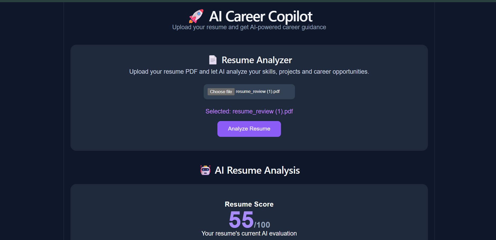

# 🚀 AI Career Copilot

AI Career Copilot is an AI-powered resume analysis and career guidance application.

Users can upload a resume PDF, and the application uses **local AI** to analyze the resume and provide:

* 📊 Resume score
* 💪 Strong skills
* ⚠️ Missing or weak skills
* 📚 Recommended skills to learn
* 💼 Suitable job roles
* 🚀 Recommended projects
* 🗺️ 3-month learning roadmap
* ✨ Resume improvement suggestions

## 📸 Project Demo



The application allows users to upload a resume PDF and receive AI-powered career analysis using a locally running **Qwen 2.5** model through **Ollama**.

## 🛠️ Tech Stack

### Frontend

* React
* Vite
* JavaScript
* CSS

### Backend

* Python
* FastAPI
* PyPDF
* Ollama

### AI

* Qwen 2.5 3B
* Ollama Local AI

## 🏗️ Project Structure

```text
AI-Career-Copilot/
│
├── backend/
│   ├── main.py
│   ├── test_ai.py
│   └── test_local_ai.py
│
├── frontend/
│   ├── src/
│   │   ├── App.jsx
│   │   ├── App.css
│   │   └── main.jsx
│   ├── package.json
│   └── vite.config.js
│
├── screenshot.png
├── README.md
└── .gitignore
```

## 🏗️ How It Works

```text
User uploads Resume PDF
          ↓
React Frontend
          ↓
FastAPI Backend
          ↓
PDF Text Extraction
          ↓
Ollama + Qwen 2.5
          ↓
AI Resume Analysis
          ↓
Career Recommendations
          ↓
React Results Dashboard
```

## 🚀 Running the Project Locally

### 1. Start Ollama

Make sure Ollama is installed and the Qwen model is available.

```bash
ollama pull qwen2.5:3b
```

Start the model:

```bash
ollama run qwen2.5:3b
```

### 2. Start the Backend

Open PowerShell:

```powershell
cd "D:\Ai project\AI-Career-Copilot\backend"
.\venv\Scripts\Activate.ps1
uvicorn main:app --reload
```

Backend:

```text
http://127.0.0.1:8000
```

API documentation:

```text
http://127.0.0.1:8000/docs
```

### 3. Start the Frontend

Open another terminal:

```powershell
cd "D:\Ai project\AI-Career-Copilot\frontend"
npm run dev
```

Open the Vite URL displayed in the terminal.

## ✨ Features

* 📄 Resume PDF upload
* 🔍 Automatic resume text extraction
* 🤖 Local AI resume analysis
* 📊 Resume scoring
* 💪 Skill identification
* ⚠️ Skill gap identification
* 💼 Career role recommendations
* 🚀 Project recommendations
* 🗺️ 3-month learning roadmap
* ✨ Resume improvement suggestions
* ⚛️ React-based user interface
* ⚡ FastAPI REST API

## 🔒 Privacy

The project is designed to use a **local AI model through Ollama**, rather than sending resume content to a paid cloud AI API.

This allows resume analysis to run locally on the user's machine.

## 📌 Future Improvements

* 🎯 Job description matching
* 📊 ATS score analysis
* 🔑 Resume keyword optimization
* ✍️ AI-powered resume rewriting
* 💼 Job recommendation system
* 🔐 User authentication
* 📂 Resume history
* 📥 Downloadable AI reports
* ☁️ Cloud deployment

## 👩‍💻 Author

**Pravalika Thigutla**

GitHub: [@pravalikathigutla-commits](https://github.com/pravalikathigutla-commits)
